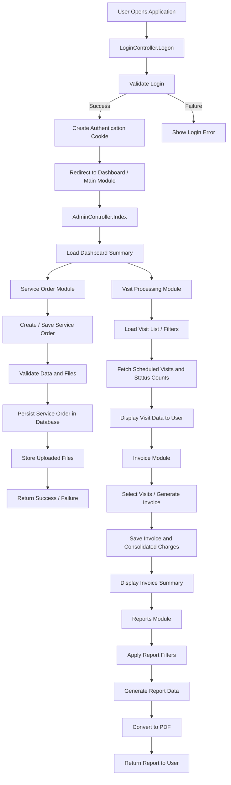

# IQEApp End-to-End Flow Chart

```mermaid
flowchart TD
    A[User Opens Application] --> B[LoginController.Logon]
    B --> C[Validate Login]
    C -->|Success| D[Create Authentication Cookie]
    C -->|Failure| E[Show Login Error]
    D --> F[Redirect to Dashboard / Main Module]
    F --> G[AdminController.Index]
    G --> H[Load Dashboard Summary]

    H --> I[Service Order Module]
    I --> J[Create / Save Service Order]
    J --> K[Validate Data and Files]
    K --> L[Persist Service Order in Database]
    L --> M[Store Uploaded Files]
    M --> N[Return Success / Failure]

    H --> O[Visit Processing Module]
    O --> P[Load Visit List / Filters]
    P --> Q[Fetch Scheduled Visits and Status Counts]
    Q --> R[Display Visit Data to User]

    R --> S[Invoice Module]
    S --> T[Select Visits / Generate Invoice]
    T --> U[Save Invoice and Consolidated Charges]
    U --> V[Display Invoice Summary]

    V --> W[Reports Module]
    W --> X[Apply Report Filters]
    X --> Y[Generate Report Data]
    Y --> Z[Convert to PDF]
    Z --> AA[Return Report to User]
```
